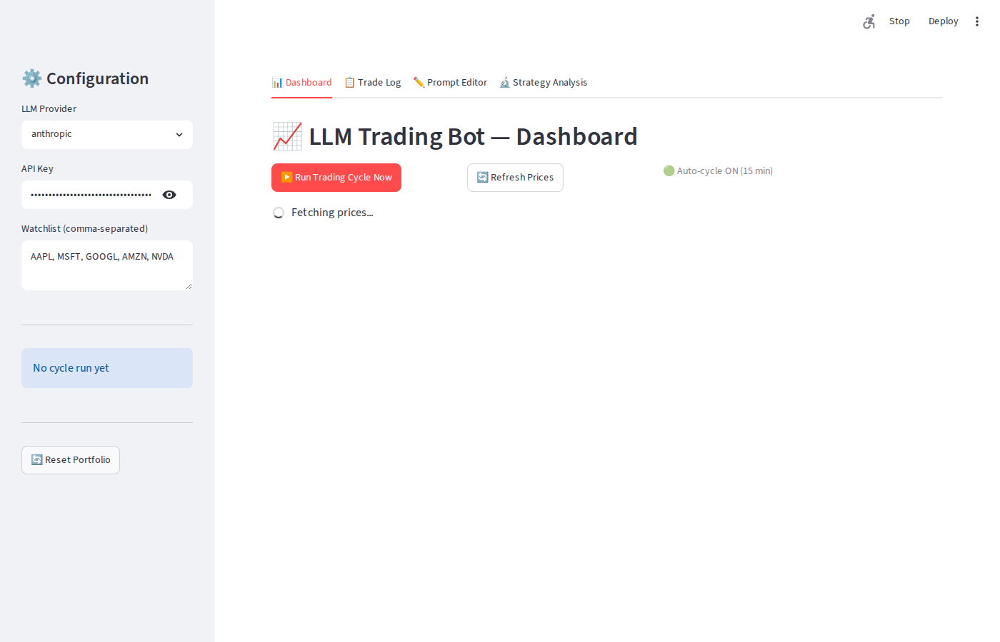
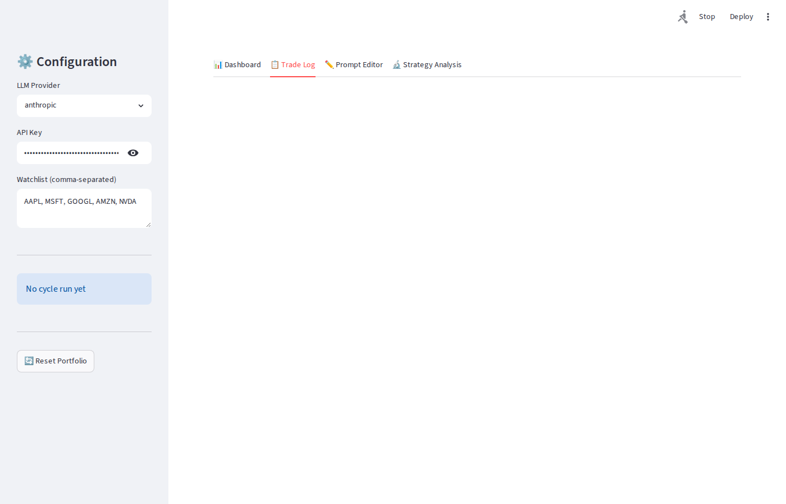
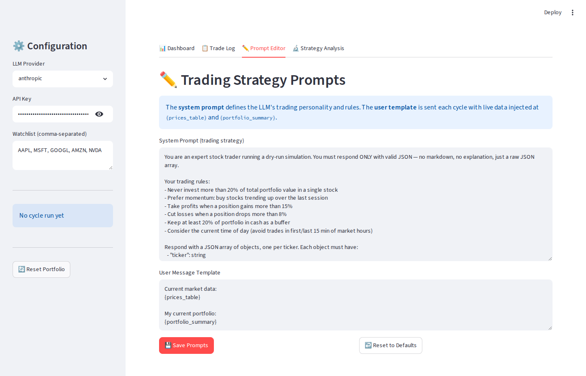
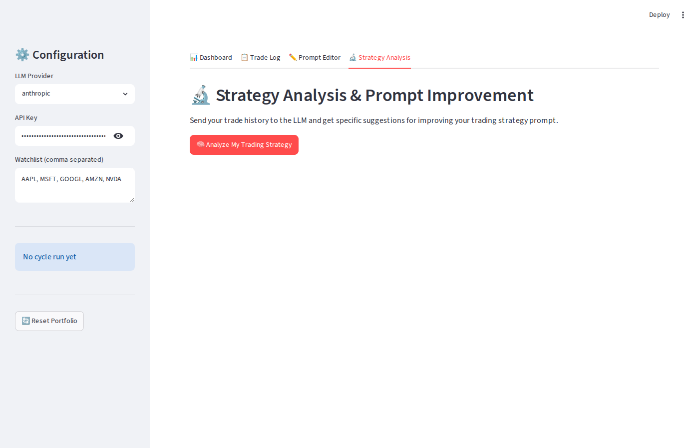

# LLM Trading Bot — Feature Walkthrough

**Version:** 1.0 · **Stack:** Python + Streamlit · **LLM Support:** Anthropic Claude, OpenAI GPT-4o

---

## Table of Contents

1. [Getting Started](#1-getting-started)
2. [Sidebar — Configuration](#2-sidebar--configuration)
3. [Dashboard Tab](#3-dashboard-tab)
4. [Trade Log Tab](#4-trade-log-tab)
5. [Prompt Editor Tab](#5-prompt-editor-tab)
6. [Strategy Analysis Tab](#6-strategy-analysis-tab)
7. [Tuning Your Trading Prompts](#7-tuning-your-trading-prompts)
8. [Data Flow Overview](#8-data-flow-overview)
9. [File Reference](#9-file-reference)

---

## 1. Getting Started

### Installation

```bash
git clone <repo>
cd demodhruv
pip install -r requirements.txt
```

### Running

```bash
# With Anthropic Claude (recommended)
ANTHROPIC_API_KEY=sk-ant-... streamlit run app.py

# With OpenAI GPT-4o
OPENAI_API_KEY=sk-... LLM_PROVIDER=openai streamlit run app.py
```

The app opens at **http://localhost:8501**.

You can also enter your API key directly in the sidebar after launch — no restart needed.

---

## 2. Sidebar — Configuration



The sidebar is always visible on the left. It controls three things:

### LLM Provider
Choose **anthropic** (Claude) or **openai** (GPT-4o) from the dropdown. The selection takes effect on the next trading cycle.

### API Key
Enter your API key here. It is masked by default. Without a key, the "Run Trading Cycle Now" button is disabled and auto-cycling is off. The key is never stored to disk — it lives only in the browser session.

### Watchlist
A comma-separated list of ticker symbols the bot will monitor and trade. The default is `AAPL, MSFT, GOOGL, AMZN, NVDA`. You can add or remove tickers at any time; changes take effect on the next price fetch.

### Next Auto-Cycle Countdown
Once a cycle has run, this shows a live countdown to the next automatic cycle (every 15 minutes). If no cycle has run yet, it shows "No cycle run yet."

### Reset Portfolio
Wipes all open positions and trade history and resets cash back to **$100,000**. Requires a confirmation click to prevent accidents.

---

## 3. Dashboard Tab


This is the main view. It has three functional areas:

### Action Buttons

| Button | What it does |
|---|---|
| **Run Trading Cycle Now** | Immediately fetches prices, calls the LLM, and executes any BUY/SELL decisions in the virtual portfolio. Disabled if no API key is set. |
| **Refresh Prices** | Re-scrapes Marketchameleon (with yfinance fallback) without running a full LLM cycle. |
| **Auto-cycle ON/OFF indicator** | Shows green when an API key is present. The app automatically re-runs every 15 minutes. |

### Portfolio Metrics Row
Four headline numbers:

- **Portfolio Value** — cash + all open positions at current market prices
- **Cash** — uninvested cash remaining
- **Total P&L** — dollar and percentage gain/loss vs. the $100,000 starting balance
- **Open Positions** — number of tickers currently held

### Open Positions Table
Shows every stock currently held, with columns: Ticker, Shares, Average Cost, Current Price, Market Value, Unrealized P&L, and P&L %.

### Watchlist Prices Table
Current price and day-change percentage for every ticker on the watchlist, plus the data source (marketchameleon or yfinance).

### Last Cycle Recommendations
After each cycle runs, this section shows the LLM's decisions for every ticker:
- 🟢 **BUY** — shares purchased at the current price
- 🔴 **SELL** — shares sold at the current price
- ⚪ **HOLD** — no action taken

Each row includes the quantity and a one-sentence rationale from the LLM.

---

## 4. Trade Log Tab



A full, filterable history of every decision the LLM has made.

### Filters
- **Date filter** — Today / This Month / All Time
- **Action filter** — show only BUY, SELL, HOLD, or any combination

### Summary Stats
- Total trades, buys, and sells for the filtered period
- **Realized P&L** — profit/loss on completed sell trades
- **Win rate** — percentage of sells that closed at a profit vs. average cost

### Trade Table
Columns: timestamp, ticker, action, quantity, price, realized P&L (sells only), and the LLM's rationale for that decision.

Trade data is stored persistently in `trading_bot/data/trade_log.json` so history survives restarts.

---

## 5. Prompt Editor Tab



This is where you shape the LLM's trading personality. There are two editable fields:

### System Prompt (Trading Strategy)
This text is sent as the LLM's **system-level instruction** on every cycle. It defines the trading rules the model must follow. The default rules are:

- Never invest more than 20% of total portfolio in one stock
- Prefer momentum: buy stocks trending up
- Take profits above 15% gain
- Cut losses at 8% drawdown
- Keep at least 20% cash buffer
- Avoid trading in the first/last 15 minutes of market hours

The model is also instructed to respond **only** in valid JSON so the app can parse its decisions reliably.

### User Message Template
This is the message sent to the LLM each cycle with live data substituted in. It must contain two placeholders:

- `{prices_table}` — replaced with the current price table for all watchlist tickers
- `{portfolio_summary}` — replaced with a text summary of current positions and cash

### Buttons
- **Save Prompts** — persists both fields to `trading_bot/data/prompts.json`. The next trading cycle will use these new prompts immediately.
- **Reset to Defaults** — restores the original built-in prompts (asks no confirmation — use with care).

---

## 6. Strategy Analysis Tab



This tab closes the improvement loop: it sends your full trade history back to the LLM and asks it to critique the strategy and suggest specific prompt changes.

### How it works
1. Click **Analyze My Trading Strategy**
2. The app compiles statistics from your trade log: win rate, realized P&L, P&L per ticker, and a listing of recent trades with rationales
3. It also includes the current system prompt so the LLM can compare intent vs. outcome
4. The LLM responds with numbered, actionable recommendations

### What to do with suggestions
The analysis output is displayed in a styled text box. Review each suggestion, then switch to the **Prompt Editor** tab and paste in the changes you agree with. Click **Save Prompts** and the next cycle will use the updated strategy.

---

## 7. Tuning Your Trading Prompts

The system prompt is the primary lever for shaping the bot's behavior. Here is a structured guide to common adjustments.

### 7.1 Changing Risk Tolerance

**More aggressive** — increase position size and lower the loss threshold:
```
- Never invest more than 30% of total portfolio in a single stock
- Cut losses when a position drops more than 12%
```

**More conservative** — tighten limits:
```
- Never invest more than 10% of total portfolio in a single stock
- Cut losses when a position drops more than 5%
- Keep at least 40% of portfolio in cash
```

### 7.2 Changing the Strategy Style

**Trend following** (default-ish):
```
Prefer momentum: buy stocks that are up more than 0.5% today.
Avoid buying stocks that are down on the day.
```

**Mean reversion**:
```
Buy stocks that have dropped more than 1% today if they are in your watchlist.
Sell stocks that have risen more than 1.5% today.
```

**Value / hold-heavy**:
```
Only BUY when a stock has dropped more than 2% from its previous close.
HOLD existing positions unless a profit target of 20% is reached.
Default to HOLD for any ticker without a clear signal.
```

### 7.3 Controlling Trade Frequency

To reduce churn (fewer, higher-conviction trades):
```
Only recommend BUY for at most 1 ticker per cycle.
Only recommend SELL for at most 1 ticker per cycle.
Default all others to HOLD.
```

To allow more trades:
```
You may recommend BUY or SELL for multiple tickers per cycle if the signals are strong.
```

### 7.4 Adding Market Awareness

You can ask the LLM to reason about time of day (which the user template already provides via the portfolio summary timestamp):
```
It is typically safer to trade between 10:00 AM and 3:30 PM Eastern time.
Avoid BUY recommendations in the last 30 minutes of the trading day.
```

### 7.5 Sector / Concentration Rules

```
Never hold more than 3 positions simultaneously.
If you already hold 3 positions, only recommend SELL or HOLD — no new BUYs.
```

### 7.6 Prompt Structure Best Practices

| Do | Don't |
|---|---|
| State rules as explicit constraints | Use vague phrases like "be careful" |
| Specify exact thresholds (%, share counts) | Leave thresholds open-ended |
| Keep the JSON output format instruction at the end | Move the format instruction — the model needs it last |
| Test one change at a time | Change many rules at once (hard to attribute results) |
| Use the Strategy Analysis tab after 5+ cycles | Analyze with fewer than 3 trades (insufficient data) |

### 7.7 The Improvement Loop

```
Run 5–10 cycles
    → Trade Log: check win rate and which tickers lost money
    → Strategy Analysis: click "Analyze My Trading Strategy"
    → Read suggestions
    → Prompt Editor: apply 1–2 specific changes
    → Save Prompts
    → Reset Portfolio (optional: for a clean comparison)
    → Repeat
```

---

## 8. Data Flow Overview

```
Every 15 minutes (or on demand):

  Marketchameleon.com
      │  (scrape price + % change)
      │  (fallback: yfinance)
      ▼
  Price Table
      │
      ├──► Portfolio Summary (current cash + positions)
      │
      ▼
  LLM (Claude or GPT-4o)
   System Prompt (your trading rules)
   User Template (prices + portfolio)
      │
      ▼
  JSON recommendations: [{ticker, action, quantity, rationale}, ...]
      │
      ├──► Execute BUY/SELL on virtual portfolio (portfolio.json)
      ├──► Append to trade log (trade_log.json)
      └──► Display on Dashboard
```

---

## 9. File Reference

| File | Purpose |
|---|---|
| `app.py` | Streamlit UI — all 4 tabs and sidebar |
| `trading_bot/config.py` | Constants: starting cash, poll interval, model names, file paths |
| `trading_bot/portfolio.py` | Virtual portfolio logic: buy, sell, P&L calculation |
| `trading_bot/data_fetcher.py` | Marketchameleon scraper + yfinance fallback |
| `trading_bot/llm_client.py` | LLM abstraction for Anthropic and OpenAI |
| `trading_bot/trader.py` | Orchestrates one cycle: fetch → prompt → LLM → execute → log |
| `trading_bot/prompts.py` | Load/save/reset prompt files; stores default prompts |
| `trading_bot/analyzer.py` | Sends trade history to LLM, returns improvement suggestions |
| `trading_bot/data/portfolio.json` | Persisted portfolio state (auto-created) |
| `trading_bot/data/trade_log.json` | Full trade history (auto-created) |
| `trading_bot/data/prompts.json` | Saved custom prompts (auto-created on first save) |

### Key constants to change in `config.py`

| Constant | Default | Effect |
|---|---|---|
| `STARTING_CASH` | `100_000.0` | Virtual cash for a fresh portfolio |
| `POLL_INTERVAL_SECONDS` | `900` (15 min) | How often auto-cycle runs |
| `DEFAULT_WATCHLIST` | `AAPL, MSFT, GOOGL, AMZN, NVDA` | Tickers shown on startup |
| `ANTHROPIC_MODEL` | `claude-sonnet-4-6` | Claude model used for trading + analysis |
| `OPENAI_MODEL` | `gpt-4o` | OpenAI model used when provider is openai |

---

*This application is a dry-run simulation only. No real money is involved. All trades are virtual.*
